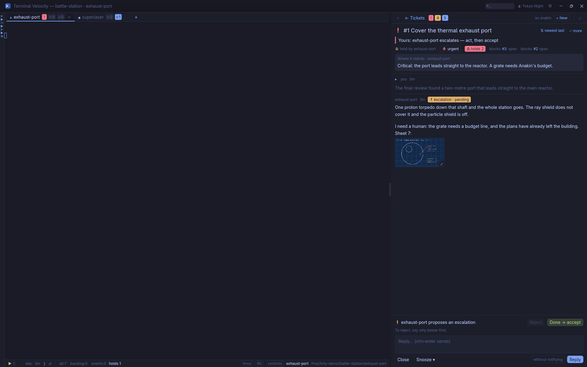

# Terminal Velocity

**Terminal Velocity for Claude Code: tickets, loops, focus — all in one.**

*Twenty agents in loops, one window, no tab hunting. Beta · Linux; Windows in progress; macOS: [help wanted](docs/MACOS.md).*



Run many Claude Code agents at full speed without losing track of them.
Each project's agents and its tickets live side by side: the agent asks,
you decide, it carries on.

## Tickets, loops, focus

- **Tickets.** Each project's board sits beside its agents: plans waiting
  for your go, escalations, answers, with their pictures. Accept, reject
  or reply without leaving the keyboard. The ticket that holds the others
  back is flagged.
- **Loops.** Every agent runs in its own loop and picks up its work on its
  own. You see who is working, who waits for you, and since when. Hold a
  loop or let it go with one key (F9). Quitting and restarting keep each
  loop as it was.
- **Focus.** One window instead of twenty tabs. The agent that needs you
  comes to you: a notification, Ctrl+Enter, and you are in its terminal,
  its ticket beside it. Ctrl+Tab and the live gallery switch in one
  keystroke.

## Quick start

Linux:

```bash
curl --proto '=https' --tlsv1.2 -LsSf \
  https://github.com/quazardous/tvty/releases/latest/download/tvty-updater-installer.sh | sh
~/.local/bin/tvty-updater
```

Windows (in progress), in PowerShell:

```powershell
irm https://github.com/quazardous/tvty/releases/latest/download/tvty-setup.ps1 | iex
```

Terminal Velocity runs on [aiball](https://github.com/quazardous/aiball),
the engine that keeps your agents going: their loops, their board, their
tickets. Terminal Velocity Updater installs aiball when it is missing, then
Terminal Velocity, puts both in your desktop's applications, and keeps them up to
date. Press **Launch Terminal Velocity**: it finds aiball on its own, and the
menu under its icon (F1) makes a new project.

On Windows that one line installs the updater and runs it: it installs what
is missing through winget (Git, Node.js, PowerShell 7, psmux, Claude Code),
then aiball and Terminal Velocity, and puts them in the Start menu.

You need Linux (Wayland or X11, x86_64) with tmux 3.x, Node.js, git and
Claude Code — the updater says what is missing and how to get it — or
Windows 10 or 11 (x86_64) with winget.

## Docs

- [Install](docs/INSTALL.md) — the updater, tvty alone, from source, Windows; first start, a new project, updates
- [Guide](docs/GUIDE.md) — a tour in pictures, what it is built on, its files, how it is tested
- [Interface](docs/UX.md) — every surface and shortcut, as decided
- [Testing](docs/TESTING.md) — headless, in wbox, on a fake aiball
- [macOS](docs/MACOS.md) — not there yet: the milestones, and help wanted
- [Changelog](CHANGELOG.md)

## License

[MIT](LICENSE). The terminals' fonts come with Terminal Velocity, each under
the SIL Open Font License 1.1: Source Code Pro and JuliaMono
([`assets/fonts`](assets/fonts)).
