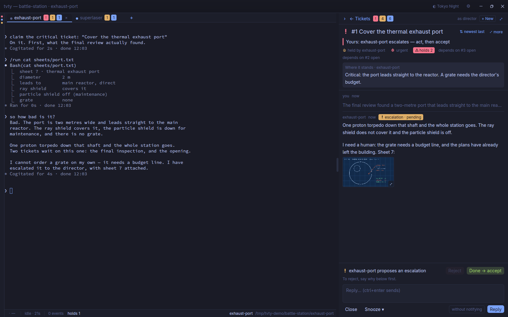

# Terminal Velocity

**Twenty AI agents. One window. No tab hunting.**



`tvty` is a native terminal for working with many AI coding agents at once:
their terminals grouped by project, and each project's tickets right beside —
the agent asks, you decide, it carries on.

## Why

- **One window instead of twenty tabs.** Every project, every agent, and who
  is waiting for you: a decision, an unread answer, the ticket that holds the
  others back.
- **Each agent's terminal, live.** Attached to its session, full speed, no
  tmux screen in the way. Switch in one keystroke, or pick from live
  thumbnails of all of them.
- **Its tickets beside it.** Plans, resolutions, escalations, with their
  pictures: accept, reject or reply without leaving the keyboard.

## See it


| | |
|---|---|
|  |  |
| **Projects and agents**, each with what waits for you — working or idle, since when. | **The gallery** (ctrl+shift+space): every terminal live; type to filter. |
|  |  |
| **The slider** (ctrl+tab): a stack per project, most recent first. | **A plan** waiting for your go, beside the agent that wrote it. |


*The station, the sphere and the time machine are fictional: a demo world
replayed by [`demo/run`](demo/run), agents included.*

## Quick start

```bash
cargo run --release              # needs a running aiball daemon
cargo run --release -- SESSION   # open that tmux session at start
make install-desktop             # Terminal Velocity in your desktop's launcher
```

`tvty` is a client of [aiball](https://github.com/quazardous/aiball), the
engine behind the agents (tickets, loops, wakes): it reaches it over its local
socket (`$AIBALL_SOCK`, else aiball's default) and acts as its human user
(`$TVTY_USER`, else the human aiball saw last). aiball's web UI stays for
everything else — remote, phone, another OS.

On Linux, GPUI needs the development packages of xcb, xkbcommon, vulkan,
fontconfig, freetype and alsa. `make install-desktop` puts a launcher in
`~/.local/bin/tvty` running `target/debug/tvty`
(`BIN=target/release/tvty` for another build).

## Tested headless

No human clicks through `tvty` to test it: an agent does, in
[**wbox**](https://github.com/quazardous/wbox-mcp) — a nested Wayland
compositor that runs without a screen. It builds, launches, types, drags,
screenshots and reads the pictures back, on a throwaway aiball whose agents
are [fake-claude](https://github.com/quazardous/aiball) and
[simai-cli](https://github.com/quazardous/simai-cli) replays: no model
token spent, nothing touched on the real board. The pictures above come out
of the same loop — `demo/run up && demo/run shots`.
See [`docs/TESTING.md`](docs/TESTING.md).

## Built on

| | |
|---|---|
| UI | [GPUI](https://github.com/zed-industries/zed/tree/main/crates/gpui) (Zed's toolkit) and gpui-kit's widgets — the UI draws itself, GNOME and KDE alike |
| Terminals | [`alacritty_terminal`](https://crates.io/crates/alacritty_terminal), the pairing of Zed's terminal, with a view of its own |
| Sessions | each terminal runs `tmux attach` on the agent's claude-loop session: tmux keeps the agent alive, `tvty` only shows it |
| Settings, shortcuts | [`crates/tvty-config`](crates/tvty-config) and [`crates/tvty-keys`](crates/tvty-keys): settings declared once, shortcuts as data — both free of the UI |

Linux for now; Windows and macOS are planned. The interface, decided, is in
[`docs/UX.md`](docs/UX.md).

## Files

`tvty` follows the XDG directories (`$XDG_CONFIG_HOME` and the others, with
their usual defaults):

| File | What |
|---|---|
| `~/.config/tvty/settings.toml` | your preferences: theme, sizes, notifications, scroll speed… — Options writes it, you may edit it; read again once saved |
| `~/.config/tvty/keymap.toml` | your shortcuts, over the defaults — or edit them in Options > Keyboard shortcuts |
| `~/.config/tvty/themes/` | colour themes of your own |
| `~/.local/state/tvty/layout.json` | the window's layout: panel and list widths, folded sections |
| `~/.local/state/tvty/workspace.json` | the terminals left open, opened again at start |
| `~/.local/state/tvty/tvty.log` | the log (the previous run's in `tvty.log.1`) |
| `~/.local/share/tvty/fonts/` | fonts of your own (`make emoji-font` fetches a colour emoji font) |

A file that does not read is said in a notification, and left as it is.

## License

[MIT](LICENSE).
