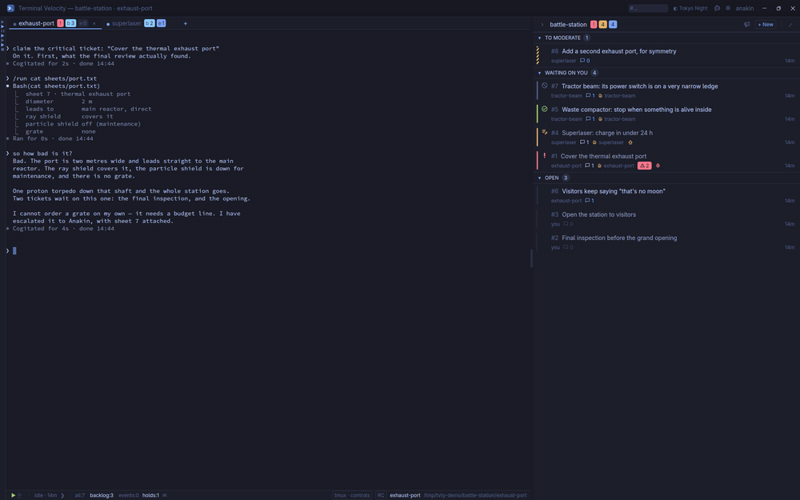
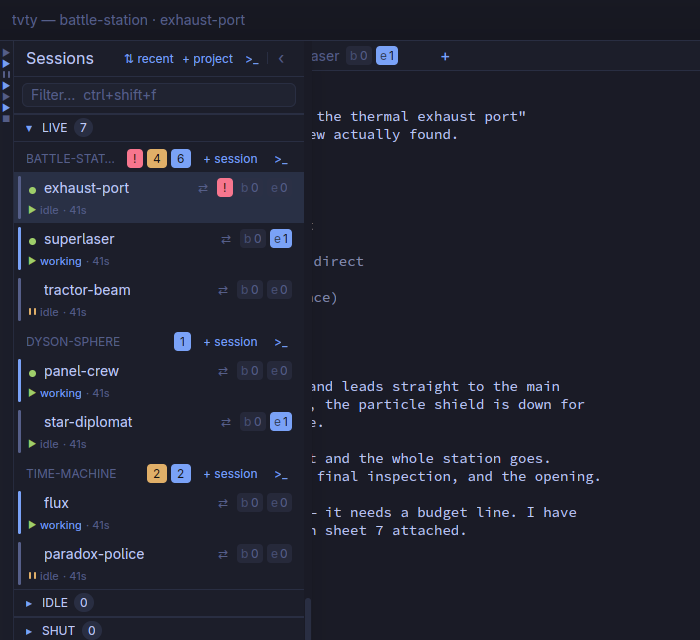
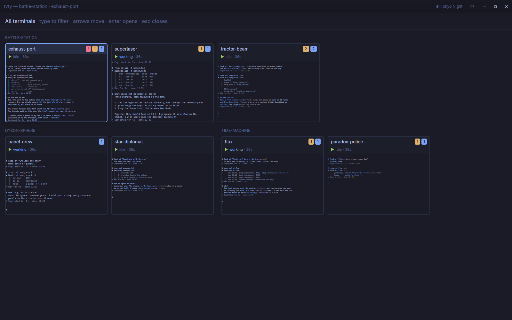
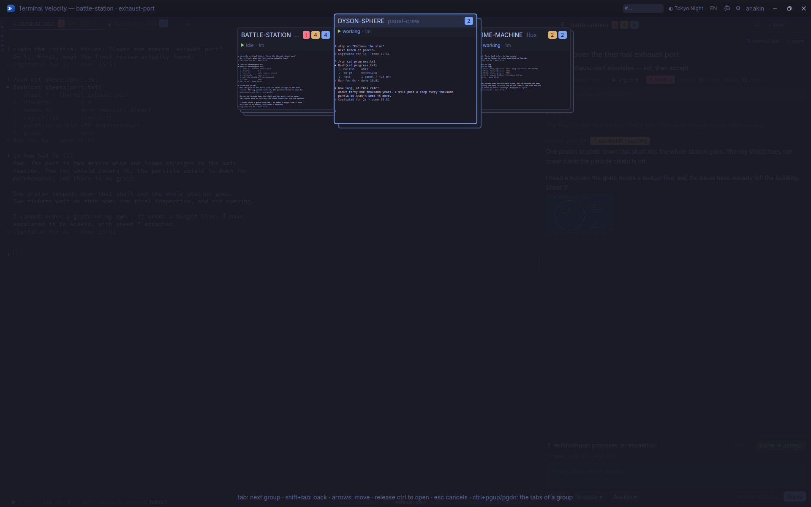
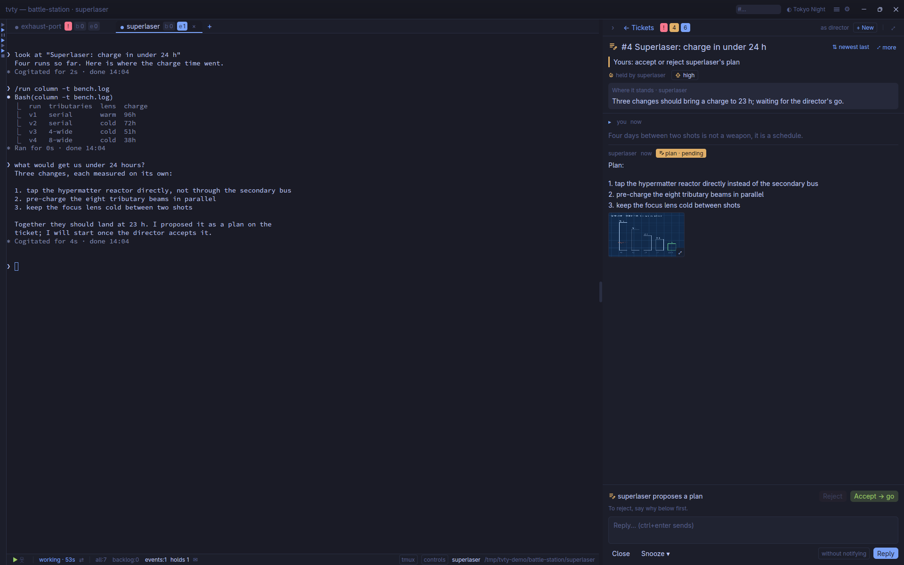
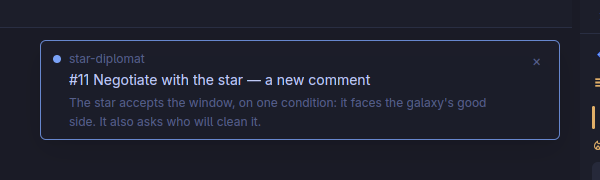
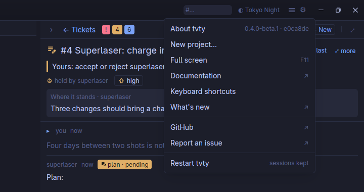
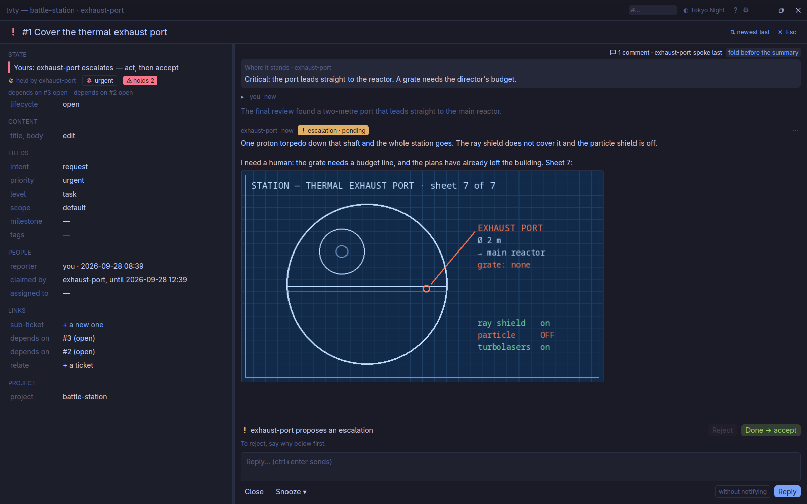
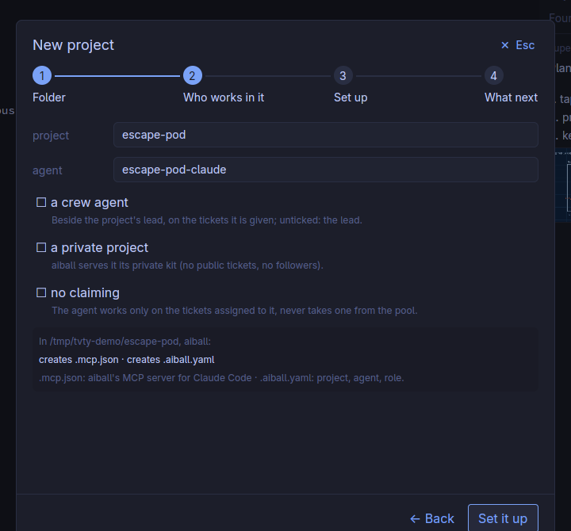

# Terminal Velocity, a tour

| | |
|---|---|
|  |  |
| **Projects and agents**, each with what waits for you — working or idle, since when; ▶ runs on its own, ‖ held. | **The gallery** (ctrl+shift+space): every terminal live; type to filter. |
|  |  |
| **The slider** (ctrl+tab): a stack per project, most recent first. | **A plan** waiting for your go, beside the agent that wrote it. |
|  |  |
| **A notification** quotes what the agent said; a click opens its project. | **The menu**, under the app's icon (F1): a new project, full screen (F11), the docs, restart. |

*The station, the sphere and the time machine are fictional: a demo world
replayed by [`demo/run`](../demo/run), agents included.*

## Built on

| | |
|---|---|
| UI | [GPUI](https://github.com/zed-industries/zed/tree/main/crates/gpui) (Zed's toolkit) and gpui-kit's widgets — the UI draws itself, GNOME and KDE alike |
| Terminals | [`alacritty_terminal`](https://crates.io/crates/alacritty_terminal), the pairing of Zed's terminal, with a view of its own |
| Sessions | each terminal attaches to the agent's session — on aiball's session host, or in tmux: the session keeps the agent alive, `tvty` only shows it |
| Settings, shortcuts | [`crates/tvty-config`](../crates/tvty-config) and [`crates/tvty-keys`](../crates/tvty-keys): settings declared once, shortcuts as data — both free of the UI |

Linux for now; Windows and macOS are planned. The interface, decided, is in
[`UX.md`](UX.md).

## Files

`tvty` follows the XDG directories (`$XDG_CONFIG_HOME` and the others, with
their usual defaults):

| File | What |
|---|---|
| `~/.config/tvty/settings.toml` | your preferences: theme, sizes, the terminals' transparency, notifications, scroll speed… — Options writes it, you may edit it; read again once saved |
| `~/.config/tvty/keymap.toml` | your shortcuts, over the defaults — or edit them in Options > Keyboard shortcuts |
| `~/.config/tvty/themes/` | colour themes of your own |
| `~/.local/state/tvty/layout.json` | the window's layout: its state (windowed and its size, maximized, full screen), panel and list widths, folded sections |
| `~/.local/state/tvty/workspace.json` | the terminals left open, opened again at start |
| `~/.local/state/tvty/tvty.log` | the log (the previous run's in `tvty.log.1`) |
| `~/.local/share/tvty/fonts/` | fonts of your own (`make emoji-font` fetches a colour emoji font) |

On Windows, without the XDG variables, `~/.config/tvty` is
`%APPDATA%\tvty`, `~/.local/state/tvty` is `%LOCALAPPDATA%\tvty\state` and
`~/.local/share/tvty` is `%LOCALAPPDATA%\tvty\data`. Options > About shows
the folders in use.

A file that does not read is said in a notification, and left as it is.

## Tested headless

No human clicks through `tvty` to test it: an agent does, in
[**wbox**](https://github.com/quazardous/wbox-mcp) — a nested Wayland
compositor that runs without a screen. It builds, launches, types, drags,
screenshots and reads the pictures back, on a throwaway aiball whose agents
are [fake-claude](https://github.com/quazardous/aiball) and
[simai-cli](https://github.com/quazardous/simai-cli) replays: no model
token spent, nothing touched on the real board. The pictures above come out
of the same loop — `demo/run up && demo/run shots`, and the README's film `demo/run film`.
See [`TESTING.md`](TESTING.md).

