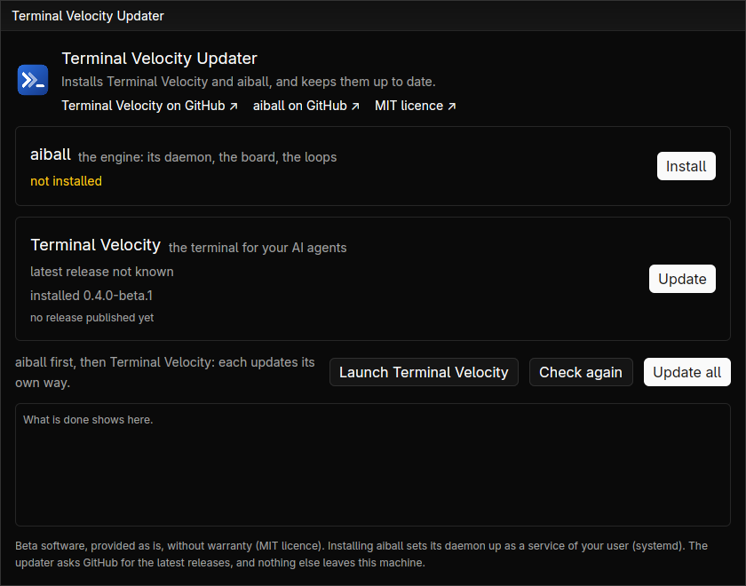

# Installing Terminal Velocity

> **Beta.** Terminal Velocity runs on
> [aiball](https://github.com/quazardous/aiball), the engine that keeps your
> Claude agents going (their loops, board and tickets): it is aiball's
> desktop client, not a standalone terminal. Linux for
> now (Wayland or X11, GNOME and KDE; x86_64). Expect rough edges, and tell
> us (the menu under the app's icon > Report an issue).

**The easy way: Terminal Velocity Updater.** One small program installs
aiball when it is missing (through aiball's own installer), then Terminal
Velocity, puts both in your desktop's applications, and keeps them up to
date — what each has, the latest release, one button, and what it does,
line by line:

```bash
curl --proto '=https' --tlsv1.2 -LsSf \
  https://github.com/quazardous/tvty/releases/latest/download/tvty-updater-installer.sh | sh
~/.local/bin/tvty-updater
```



Later, **Updates…** in Terminal Velocity's menu opens it again; tvty says
itself when a newer release is out (Options > Layout > Updates turns that
off).

**You need** the libraries every Wayland or X11 desktop has (xkbcommon,
Vulkan, fontconfig, freetype), and four programs: **git** and **Node.js**
(aiball's), **tmux** 3.x (the loops in tmux mode) and **Claude Code** (the
agents themselves; run `claude` once to sign in). The updater checks them
before it installs anything: its window lists what is missing, each with
the command to copy for your distribution (dnf, apt, pacman, zypper).
**Claude Code it installs itself**, by Claude Code's own installer (no
`sudo`): the **Install** button beside it in the window, and
`tvty-updater --install` does it first (`tvty-updater --prerequisites`
does only that). The three others are your package manager's, and need
your password: the updater names them and `--install` fails while one is
missing. `tvty-updater --check` only says what is missing.

**Terminal Velocity alone**, without the updater, from the same release:

```bash
curl --proto '=https' --tlsv1.2 -LsSf \
  https://github.com/quazardous/tvty/releases/latest/download/tvty-installer.sh | sh
```

**From source** — Rust (stable, 1.85 or later) and GPUI's system libraries:

```bash
# Fedora
sudo dnf install gcc pkgconf-pkg-config libxkbcommon-devel libxkbcommon-x11-devel \
  libxcb-devel wayland-devel vulkan-loader-devel fontconfig-devel freetype-devel alsa-lib-devel
# Debian, Ubuntu
sudo apt install build-essential pkg-config libxkbcommon-dev libxkbcommon-x11-dev \
  libxcb1-dev libwayland-dev libvulkan-dev libfontconfig-dev libfreetype-dev libasound2-dev
# Arch
sudo pacman -S base-devel libxkbcommon libxkbcommon-x11 libxcb wayland \
  vulkan-icd-loader fontconfig freetype2 alsa-lib

git clone https://github.com/quazardous/tvty && cd tvty
cargo build --release
make install-desktop BIN=$PWD/target/release/tvty
```


## Windows (in progress)

Terminal Velocity builds and starts on Windows 10 and 11 (x86_64), and its
releases carry a Windows build. Expect gaps: it needs an aiball recent
enough to write its machine secret (without it, tvty cannot list or start
the agents' loops), and the agents' sessions run under psmux. One line in PowerShell
installs everything:

```powershell
irm https://github.com/quazardous/tvty/releases/latest/download/tvty-setup.ps1 | iex
```

It installs Terminal Velocity Updater (into `~\.local\bin`, added to your
PATH), and the updater does the rest: what is missing through winget (Git,
Node.js LTS, PowerShell 7, psmux, Claude Code), then aiball through its own
`install.ps1`, Terminal Velocity itself, and both programs in the Start
menu. It says what
failed, if anything; run it again once that is fixed, it skips what is
there. Without winget (Windows Sandbox, some LTSC editions) it names what to
install, each with its command.

Everything it says, and everything the installers say, is also kept in
`%LOCALAPPDATA%\tvty\setup.log` (your home folder written `~`): when it goes
wrong, that is the file to attach to an
[issue](https://github.com/quazardous/tvty/issues).

`tvty-updater --install` does that second part alone, and the updater's
window does it too: it lists what is missing, an Install button on each
line. Settings live in `%APPDATA%\tvty`, the
layout and the log in `%LOCALAPPDATA%\tvty`.

**Terminal Velocity alone**, without the updater, stays possible: its own
installer, from the same release, puts `tvty.exe` in `~\.local\bin` and adds
that folder to your PATH.

```powershell
irm https://github.com/quazardous/tvty/releases/latest/download/tvty-installer.ps1 | iex
```

It installs nothing else: not what tvty and aiball need (Git, Node.js,
PowerShell 7, psmux, Claude Code), not aiball, no Start menu shortcut, and
nothing keeps it up to date. `tvty-updater-installer.ps1`, beside it,
installs the updater alone the same way; its window then installs the rest.

## Updates

Terminal Velocity says itself, once, when a newer release is out (at start
and once a day; Options > Layout > Updates turns that off), and at start
when aiball is older than it needs. **Updates…** in its menu (under the
app's icon) opens Terminal Velocity Updater, which updates aiball its own way
(`aiball update`) and Terminal Velocity from its release, the version in
place kept to go back to.

## First start

 `tvty` finds aiball over its local socket (`$AIBALL_SOCK`,
else aiball's default) and acts as its human user (`$TVTY_USER`, else the
human aiball saw last); Options > About says which socket and which user,
and whether the bus answered. `tvty SESSION` opens that tmux session at
start. aiball's web UI stays for everything else — remote, phone, another
OS.


## A new project

 The menu's **New project** (under the app's icon, top left), or **+ project** atop the
sessions list, walks through it: pick a folder, name the project and its
agent, and aiball sets it up (its `project.init`), then says what comes next
(accepting aiball's MCP server in Claude) and starts its first session.

One tvty runs per state directory (`~/.local/state/tvty`): launching it again
brings the running one forward, on the session asked for, and the second
launch ends there. A tvty with another state directory (`XDG_STATE_HOME`, as
the test environment sets it) stays apart; `TVTY_NEW_INSTANCE=1` opens one
more anyway. The menu's **Restart tvty** starts it afresh — after an update,
say — and the agents' sessions keep running.


## Uninstall

Remove `~/.local/bin/tvty`, `~/.local/bin/tvty-updater` and their launchers
(`~/.local/share/applications/tvty*.desktop`); your settings stay in
`~/.config/tvty` and `~/.local/state/tvty`. aiball uninstalls its own way
(`./install.sh --uninstall` in its checkout).

On Windows: remove `tvty.exe` and `tvty-updater.exe` from `~\.local\bin`
and their shortcuts from the Start menu; the settings stay in
`%APPDATA%\tvty` and `%LOCALAPPDATA%\tvty`.
